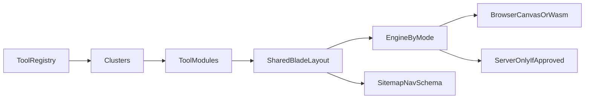

# Architecture

## Purpose

This document describes the runtime: one Laravel application, a registry of tool modules, a shared Blade layout, and engines that run in the browser. It also specifies the file catalog and the table rules to use if a database is added later.

Decisions behind this shape:

- [adr/002-client-side-images.md](adr/002-client-side-images.md)
- [adr/003-modular-monolith.md](adr/003-modular-monolith.md)
- [adr/004-tool-module-contract.md](adr/004-tool-module-contract.md)
- [adr/005-files-then-database.md](adr/005-files-then-database.md)

## Shape



There is one deployable app. Clusters and tools are data. The layout does not branch on a tool id except to mount the engine key and to print that tool's copy.

## Request path

1. `GET /{slug}` hits a single tool route registered after fixed routes (`/images`, `/guides/...`, `/about`, and the other reserved paths).
2. The registry resolves the slug. Unknown slug: 404. `draft`: 404. `live`: 200.
3. Blade renders the shared tool layout with the record, the markdown guide, and FAQ.
4. The HTML includes a mount point: `data-engine`, `data-preset`, and `data-limits`. It does not include image bytes.
5. The visitor picks a file. The engine runs locally and offers a download. No image request is made to Laravel.

Preset pages are the same route and layout. The record's `preset_of` points at the parent id, and `preset` holds the default frame. The engine key is the parent's engine.

Guides, the hub, and policy pages are separate Blade views. They read cluster and tool lists from the same registry.

## Module contract

Each live tool is one directory under `content/tools/{id}/`:

```text
content/tools/compress-image/
  tool.php
  guide.md
content/clusters/images.php
content/guides/webp-vs-jpeg.md
```

`tool.php` returns the record. `guide.md` is the unique body under the tool (headings and paragraphs only, rendered to HTML with a markdown library that does not allow raw inline HTML from the file).

### Record fields

| Field | Required | Rule |
| --- | --- | --- |
| `id` | Yes | Stable string, unique, matches the directory name |
| `slug` | Yes | Unique URL slug |
| `cluster` | Yes | Must match a cluster id |
| `status` | Yes | `draft` or `live` |
| `engine` | Yes | Key in the engine map |
| `processing` | Yes | `browser` or `server` |
| `title` | Yes | H1 |
| `promise` | Yes | One sentence under the H1 |
| `seo_title` | Yes | Document title |
| `seo_description` | Yes | Meta description, written for this URL |
| `related` | Yes | List of tool ids, may be empty |
| `limits` | Yes | At least `max_bytes` and `max_edge` |
| `preset_of` | Presets | Parent tool id |
| `preset` | Presets | Array of named frames; one is `default` |
| `faq` | Yes | List of question and answer pairs, at least three at launch |
| `suffix` | Yes | Filename suffix, such as `compressed` |

Cluster file fields: `id`, `slug`, `title`, `promise`, `status`.

Validation runs in the registry loader (a test or an artisan command). A bad record fails the build. It is not papered over in Blade with defaults that hide missing copy.

### Engine map

| Key | Implementation | Loaded on |
| --- | --- | --- |
| `canvas-transform` | Custom module: decode, resize, crop, rotate, flip, `toBlob` convert | Resize, convert, crop, rotate, all four presets |
| `squoosh-compress` | Custom UI plus dynamic import of mozjpeg, oxipng, webp | Compress only |
| `metadata-strip` | `exifr` read, then canvas re-encode at high quality to drop EXIF | Strip metadata only |

The map is a JavaScript dictionary of dynamic imports, keyed by `engine`. Routes do not `if` on slug to choose a script beyond setting `data-engine`.

`processing: server` is a legal value and has no launch implementation. The loader rejects `live` + `server` unless a cost-note path is referenced in the record (`cost_note` pointing at a markdown file in `content/cost-notes/`). Launch tools are all `browser` and have no cost note.

## Canvas pipeline

Shared steps inside `canvas-transform` and reused by compress and strip where noted:

1. `createImageBitmap` (or an HTML image element where a browser needs it) from the `File`.
2. Reject if `limits.max_bytes` or `limits.max_edge` is exceeded. For edge, measure the bitmap.
3. Draw to a canvas with the operation (scale with image smoothing on, crop rect, or transforms for rotate and flip).
4. Export with `toBlob`. JPEG and WebP quality for ordinary convert defaults are in the tool spec. Compress ignores this step and uses Squoosh instead.
5. Build an object URL, show preview, set the download name, revoke the previous URL.

GIF: decode the first frame and set a flag the UI shows. Do not attempt to preserve animation at launch.

Strip metadata uses the same draw at the original pixel size and exports the original format when it is JPEG, PNG, or WebP, at high quality (JPEG/WebP quality 0.92). That re-encode drops EXIF. The page tells the visitor the file may change by a few bytes because the pixels were rewritten. A lossless EXIF strip is not a launch requirement.

Memory: one bitmap and one export URL at a time. Start over and a new file revoke the old URL and drop references so the browser can collect the bitmap.

## File catalog and cache

The registry scans `content/` on boot in local development. In production, `php artisan config:cache` or a dedicated `registry:cache` command written for this app freezes the parsed records. Pick one mechanism and use it in the deploy script. Do not parse markdown on every request in production.

There is no uploads disk. The contact form posts name, email, and message to a controller that sends mail and redirects back with a status flash. It does not insert a row.

## Future database

Do not create these tables at launch. When production editing without a deploy is required, add them as specified here and in [adr/005-files-then-database.md](adr/005-files-then-database.md). Import from the files. Git stays the review path until an admin UI exists; after that, publish still writes through a controlled action, not ad-hoc SQL.

### `clusters`

| Column | Type | Rules |
| --- | --- | --- |
| `id` | bigint primary key | Surrogate |
| `key` | string unique | Stable id, such as `images` |
| `slug` | string unique | Hub path |
| `title` | string | |
| `promise` | text | |
| `status` | string | Check constraint: `draft` or `live` |
| `sort` | unsigned integer | Index |

### `tools`

| Column | Type | Rules |
| --- | --- | --- |
| `id` | bigint primary key | |
| `key` | string unique | Stable id |
| `cluster_id` | foreign key | Not null, `ON DELETE RESTRICT` |
| `slug` | string unique | Index |
| `engine` | string | Index not required |
| `processing` | string | Check: `browser` or `server` |
| `status` | string | Check: `draft` or `live`. Index |
| `preset_of_id` | nullable foreign key to `tools` | `ON DELETE RESTRICT` |
| `title`, `promise`, `seo_title`, `seo_description`, `suffix` | strings | `seo_description` may be text |
| `limits` | JSON | Schema-validated |
| `preset` | JSON nullable | Schema-validated frames |
| `related` | JSON | Array of tool keys, validated to exist |
| `guide_path` | string | Markdown path, or a later `guide_markdown` text column if the admin stores the body. The body remains markdown |
| `sort` | unsigned integer | |

Indexes: unique `slug`, unique `key`, index `cluster_id`, index `status`.

### `tool_presets`

Use this table only if the JSON `preset` column becomes hard to edit. Prefer the JSON column first.

| Column | Rules |
| --- | --- |
| `tool_id` | Foreign key, `ON DELETE CASCADE` only for preset rows, not for tools |
| `key` | Unique per tool |
| `label` | |
| `options` | JSON, schema-validated, not one column per knob |
| `is_default` | One default per tool, enforced in application code or a partial unique index |

### Explicitly absent

- No `uploads`, `images`, or blob columns.
- No user table at launch, and no user-file relation later without a new ADR.
- No analytics fact tables in this database.

## Shared surfaces

These exist once:

- Tool Blade layout
- Header cluster links
- Footer
- Sitemap builder
- JSON-LD partial
- Ad slot partial
- Privacy sentence partial: "Processed in this browser. We do not upload this image." Server tools, if they ever exist, use a different sentence: "Uploaded for this job and deleted after the response," plus the retention interval from the cost note. Launch does not render that sentence.

## What a later build must not violate

- Do not add a route file per tool that copies the layout.
- Do not read or write visitor images on the server in a `browser` tool.
- Do not mark `server` live without a cost note.
- Do not create upload tables "for later" during launch migrations.
- Do not fork the registry into a second source (a hardcoded PHP array in a view composer plus the files).
